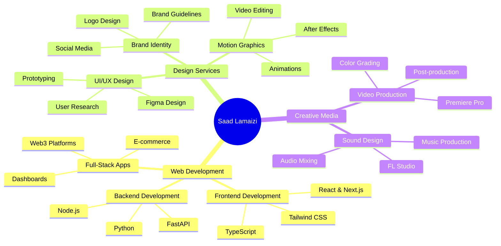

<div align="center">

# 👋 Hi, I'm Saad Lamaizi


</div>

---

## 🚀 About Me

```typescript
const saadLamaizi = {
    role: "Full-Stack Developer & Creative Designer",
    location: "Morocco 🇲🇦",
    languages: ["English", "Français", "العربية"],
    
    currentFocus: "Building modern web experiences",
    
    skills: {
        frontend: ["React", "Next.js", "TypeScript", "Tailwind CSS"],
        backend: ["Node.js", "Python", "FastAPI", "MongoDB"],
        design: ["Figma", "Photoshop", "After Effects", "Premiere Pro"],
        tools: ["Git", "VS Code", "FL Studio", "Caddy"]
    },
    
    workingOn: "🎨 Personal Portfolio & Web3 Projects",
    openTo: "Freelance opportunities & collaborations",
    
    motto: "Creativity meets functionality ✨"
};
```

---

## 🛠️ Tech Stack

<div align="center">

### 💻 Frontend Development


### ⚙️ Backend Development


### 🎨 Design & Media Tools


### 🔧 Tools & Platforms


</div>

---

## 📊 GitHub Statistics

<div align="center">
  


</div>

<div align="center">
  


</div>

---

## 🔥 Featured Projects

<div align="center">

<table>
  <tr>
    <td width="50%">
      <h3 align="center">🥤 Coca-Cola Website</h3>
      <div align="center">  
        <a href="https://github.com/saadla98/coca-cola-website" target="_blank">
          
        </a>
        <br>
        <p>
          <a href="https://github.com/saadla98/coca-cola-website" target="_blank">
            
          </a>  
        </p>
        <p><strong>Next.js 14, React 18, TypeScript, Framer Motion</strong></p>
        <p>Modern Coca-Cola website with 13+ pages, 20+ images, 100+ animations & custom cursor effects</p>
      </div>
    </td>
    <td width="50%">
      <h3 align="center">🚗 BMW Website</h3>
      <div align="center">  
        <a href="https://github.com/saadla98/bmw-website" target="_blank">
          
        </a>
        <br>
        <p>
          <a href="https://github.com/saadla98/bmw-website" target="_blank">
            
          </a>  
        </p>
        <p><strong>Next.js 14, React 18, TypeScript, Tailwind CSS</strong></p>
        <p>Premium BMW website showcasing 4 models with sleek design & ultimate driving experience</p>
      </div>
    </td>
  </tr>
  <tr>
    <td width="50%">
      <h3 align="center">🎨 ArtisanConnect</h3>
      <div align="center">  
        <a href="https://github.com/saadla98/ArtisanConnect" target="_blank">
          
        </a>
        <br>
        <p>
          <a href="https://github.com/saadla98/ArtisanConnect" target="_blank">
            
          </a>  
        </p>
        <p><strong>Vue.js 3, Vite, Tailwind CSS, Web3, MongoDB</strong></p>
        <p>Web 3.0 platform connecting skilled artisans with customers using blockchain technology</p>
      </div>
    </td>
    <td width="50%">
      <h3 align="center">🤖 PiwPiw Discord Bot</h3>
      <div align="center">  
        <a href="https://github.com/saadla98/piwpiw-website" target="_blank">
          
        </a>
        <br>
        <p>
          <a href="https://github.com/saadla98/piwpiw-website" target="_blank">
            
          </a>  
        </p>
        <p><strong>Python, discord.py, FastAPI, React, TypeScript</strong></p>
        <p>Multilingual Discord bot with points system, economy, minigames & web dashboard</p>
      </div>
    </td>
  </tr>
</table>

</div>

---

## 🎯 What I Do

<div align="center">

| 💻 **Web Development** | 🎨 **UI/UX Design** | 🎬 **Video Editing** | 🎵 **Sound Design** |
|:---:|:---:|:---:|:---:|
| Full-stack web apps | Modern interfaces | Motion graphics | Music production |
| React & Next.js | Figma prototypes | Video editing | FL Studio |
| TypeScript apps | Brand identity | After Effects | Audio mixing |
| Responsive design | User experience | Premiere Pro | Sound effects |

</div>

---

## 📈 Contribution Activity

<div align="center">

<!--START_SECTION:activity-->
<!--END_SECTION:activity-->


</div>

---

## 💼 Services I Offer

<div align="center">



</div>

---

## 🌟 Professional Highlights

<div align="center">

| 🎯 Metric | 📊 Achievement |
|:---|:---:|
| **Years of Experience** | 3+ Years |
| **Projects Completed** | 15+ Projects |
| **Technologies Mastered** | 25+ Tools |
| **Languages Spoken** | English, Français, العربية |
| **Client Satisfaction** | ⭐⭐⭐⭐⭐ 5.0/5.0 |
| **Response Time** | < 24 Hours |
| **Availability** | Open for Freelance |

</div>

---

## 📫 Let's Connect & Collaborate

<div align="center">

[](https://saadlamaizi.vercel.app)
[](https://linkedin.com/in/saad-lamaizi)
[](mailto:lamaiziisaad@gmail.com)
[](https://github.com/saadla98)

<br>

### 💡 "Turning creative visions into digital reality"

<br>


**⭐ If you like my work, consider giving my repos a star!**

</div>

---

<div align="center">

### 🚀 Available for Freelance Projects | Open to Collaboration

**📧 Let's build something amazing together!**

</div>
